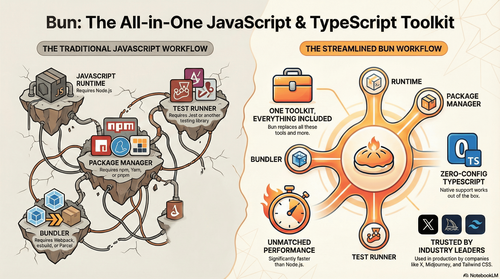

# kintsugi-stack-bun

> “Bun aims to ship everything you need out of the box.” — Jarred Sumner

- Author: [Kintsugi-Programmer](https://github.com/kintsugi-programmer)



> Disclaimer: The content presented here is a curated blend of my personal learning journey, experiences, open-source documentation, and invaluable knowledge gained from diverse sources. I do not claim sole ownership over all the material; this is a community-driven effort to learn, share, and grow together.

## Table of Contents
- [kintsugi-stack-bun](#kintsugi-stack-bun)
  - [Table of Contents](#table-of-contents)
  - [Introduction to Bun](#introduction-to-bun)
    - [What is Bun?](#what-is-bun)
    - [Why Learn Bun?](#why-learn-bun)
      - [Key Reasons:](#key-reasons)
  - [Web Development Concepts Refresher](#web-development-concepts-refresher)
    - [What is JavaScript?](#what-is-javascript)
    - [What is a Runtime?](#what-is-a-runtime)
    - [What is a Server?](#what-is-a-server)
    - [What is an API?](#what-is-an-api)
    - [What is HTTP?](#what-is-http)
    - [Client vs Server](#client-vs-server)
  - [Course Overview](#course-overview)
    - [Topics Covered:](#topics-covered)
  - [What is Bun? - Detailed Explanation](#what-is-bun---detailed-explanation)
    - [Bun vs Node.js](#bun-vs-nodejs)
      - [Similarities:](#similarities)
      - [Key Differences:](#key-differences)
  - [Bun Features Breakdown](#bun-features-breakdown)
    - [1. Fast JavaScript Runtime](#1-fast-javascript-runtime)
    - [2. Fast JavaScript Package Manager](#2-fast-javascript-package-manager)
    - [3. Fast JavaScript Bundler](#3-fast-javascript-bundler)
    - [4. Fast JavaScript Test Runner](#4-fast-javascript-test-runner)
    - [5. Node-Compatible Runtime](#5-node-compatible-runtime)
  - [Companies Using Bun](#companies-using-bun)
  - [Installation](#installation)
    - [Windows (PowerShell)](#windows-powershell)
    - [Linux \& MacOS](#linux--macos)
    - [Using npm (The last npm command you'll ever need)](#using-npm-the-last-npm-command-youll-ever-need)
    - [Verify Installation](#verify-installation)
  - [Quick Start Project Setup](#quick-start-project-setup)
    - [Initialize New Project](#initialize-new-project)
    - [Project Structure](#project-structure)
  - [Bun as a Runtime](#bun-as-a-runtime)
    - [What is a Runtime?](#what-is-a-runtime-1)
    - [1. Running Files](#1-running-files)
      - [Basic Execution](#basic-execution)
      - [Watch Mode (Auto-reload on save)](#watch-mode-auto-reload-on-save)
      - [Watch Mode (Auto-reload on save)](#watch-mode-auto-reload-on-save-1)
    - [2. Package.json Scripts](#2-packagejson-scripts)
  - [File Imports](#file-imports)
    - [Importing Text Files](#importing-text-files)
    - [Importing JSON Files](#importing-json-files)
    - [Importing TypeScript Modules](#importing-typescript-modules)
  - [Environment Variables](#environment-variables)
    - [What are Environment Variables?](#what-are-environment-variables)
    - [Basic Usage](#basic-usage)
    - [Three Ways to Access Environment Variables](#three-ways-to-access-environment-variables)
      - [Method 1: process.env](#method-1-processenv)
      - [Method 2: Bun.env](#method-2-bunenv)
      - [Method 3: import.meta.env](#method-3-importmetaenv)
    - [Type Safety for Environment Variables](#type-safety-for-environment-variables)
    - [Multiple Environment Files](#multiple-environment-files)
    - [Using NODE\_ENV](#using-node_env)
  - [File I/O Operations](#file-io-operations)
    - [What is File I/O?](#what-is-file-io)
    - [Reading Files with Bun.file](#reading-files-with-bunfile)
    - [File Properties](#file-properties)
    - [Check File Existence](#check-file-existence)
    - [Writing Files](#writing-files)
    - [Copying Files](#copying-files)
  - [Working with Directories](#working-with-directories)
    - [Create Directory](#create-directory)
    - [Read Directory](#read-directory)
    - [Get Current Directory](#get-current-directory)
  - [import.meta Object](#importmeta-object)
    - [Available Properties](#available-properties)
      - [1. import.meta.dir](#1-importmetadir)
      - [2. import.meta.dirname (Alias)](#2-importmetadirname-alias)
      - [3. import.meta.env](#3-importmetaenv)
      - [4. import.meta.file](#4-importmetafile)
      - [5. import.meta.path](#5-importmetapath)
      - [6. import.meta.filename (Alias)](#6-importmetafilename-alias)
      - [7. import.meta.url](#7-importmetaurl)
      - [8. import.meta.resolve()](#8-importmetaresolve)
    - [Node.js Compatibility](#nodejs-compatibility)
  - [Hashing \& Encryption](#hashing--encryption)
    - [What is Password Hashing?](#what-is-password-hashing)
    - [Password Hashing](#password-hashing)
      - [Hash a Password](#hash-a-password)
      - [Verify Password](#verify-password)
    - [Complete Example](#complete-example)
    - [Argon2 Algorithm](#argon2-algorithm)
  - [Bun Utilities](#bun-utilities)
    - [1. Bun.version](#1-bunversion)
    - [2. Bun.env](#2-bunenv)
    - [3. Bun.sleep()](#3-bunsleep)
    - [4. crypto.randomUUID()](#4-cryptorandomuuid)
    - [5. Bun.nanoseconds()](#5-bunnanoseconds)
    - [6. Bun.deepEquals()](#6-bundeepequals)
  - [HTTP Server with Bun.serve](#http-server-with-bunserve)
    - [What is an HTTP Server?](#what-is-an-http-server)
    - [Basic Server Setup](#basic-server-setup)
    - [Routes Configuration](#routes-configuration)
    - [Dynamic Route Parameters](#dynamic-route-parameters)
    - [Better Routing with Routes Object](#better-routing-with-routes-object)
  - [Complete CRUD API Example](#complete-crud-api-example)
    - [What is CRUD?](#what-is-crud)
    - [What are HTTP Methods?](#what-are-http-methods)
    - [Setup](#setup)
    - [GET All Posts](#get-all-posts)
    - [POST Create Post](#post-create-post)
    - [PUT Update Post](#put-update-post)
    - [DELETE Post](#delete-post)
    - [Complete Server Code](#complete-server-code)
  - [Query Parameters](#query-parameters)
    - [What are Query Parameters?](#what-are-query-parameters)
    - [Parsing Query Parameters](#parsing-query-parameters)
  - [Rendering HTML Pages](#rendering-html-pages)
    - [What is HTML?](#what-is-html)
    - [Serving HTML Files](#serving-html-files)
  - [URL Redirection](#url-redirection)
  - [Global Error Handling](#global-error-handling)
  - [HTTPS/TLS Configuration](#httpstls-configuration)
  - [Server Utilities](#server-utilities)
    - [Request Timeout](#request-timeout)
    - [Get Client IP](#get-client-ip)
    - [Graceful Shutdown](#graceful-shutdown)
  - [Console API](#console-api)
    - [Reading Terminal Input](#reading-terminal-input)
  - [Color API](#color-api)
    - [Converting Color Formats](#converting-color-formats)
  - [Shell Scripting with Bun](#shell-scripting-with-bun)
    - [Basic Shell Commands](#basic-shell-commands)
    - [Fetching and Piping](#fetching-and-piping)
    - [Real-World Example](#real-world-example)
  - [Web APIs](#web-apis)
    - [Available APIs:](#available-apis)
  - [Bun as a Package Manager](#bun-as-a-package-manager)
    - [What is a Package Manager?](#what-is-a-package-manager)
    - [Installing Dependencies](#installing-dependencies)
      - [Install All Dependencies](#install-all-dependencies)
      - [Add Package](#add-package)
    - [Removing Dependencies](#removing-dependencies)
    - [Updating Dependencies](#updating-dependencies)
    - [Other Commands](#other-commands)
      - [Check Outdated Packages](#check-outdated-packages)
      - [Publish Package](#publish-package)
      - [Link Local Package](#link-local-package)
    - [Speed Comparison](#speed-comparison)
  - [Bun Create Command](#bun-create-command)
    - [Creating Projects from Templates](#creating-projects-from-templates)
      - [React + Vite Project](#react--vite-project)
      - [Hono.js Project](#honojs-project)
    - [Available Templates](#available-templates)
  - [Testing with Bun](#testing-with-bun)
    - [What is Testing?](#what-is-testing)
    - [What is the Test Runner?](#what-is-the-test-runner)
    - [Setting Up Tests](#setting-up-tests)
      - [Test File Structure](#test-file-structure)
    - [Writing Tests](#writing-tests)
    - [Running Tests](#running-tests)
    - [Testing Functions](#testing-functions)
    - [Test Output](#test-output)
  - [Bun as a Bundler](#bun-as-a-bundler)
    - [What is a Bundler?](#what-is-a-bundler)
    - [Building TypeScript to JavaScript](#building-typescript-to-javascript)
      - [Basic Build](#basic-build)
    - [Build from Source Directory](#build-from-source-directory)
    - [Minified Build](#minified-build)
    - [Build Features](#build-features)
  - [Important Notes \& Best Practices](#important-notes--best-practices)
    - [Port 6000 Restriction](#port-6000-restriction)
    - [Environment Variables Best Practices](#environment-variables-best-practices)
    - [Package Manager Advantages](#package-manager-advantages)
    - [TypeScript Support](#typescript-support)
    - [Testing Advantages](#testing-advantages)
  - [Common Patterns \& Examples](#common-patterns--examples)
    - [API Server Template](#api-server-template)
    - [File Operations Template](#file-operations-template)
    - [Environment Setup Template](#environment-setup-template)
  - [Comparison: Node.js vs Bun](#comparison-nodejs-vs-bun)
  - [Conclusion](#conclusion)
    - [Key Takeaways:](#key-takeaways)
    - [When to Use **Bun**](#when-to-use-bun)
    - [When to Stick with **Node.js**](#when-to-stick-with-nodejs)
  - [Resources](#resources)

---

## Introduction to Bun

> Complete Bun JavaScript & TypeScript Runtime Documentation

### What is Bun?
- **Bun** is a fast JavaScript runtime (alternative to Node.js)
- Introduced approximately 2-3 years ago
- Written in **Zig language** (not C++ like Node.js)
- Provides an **all-in-one toolkit** for JavaScript/TypeScript development

### Why Learn Bun?

#### Key Reasons:
1. **Market Relevance**: Projects may require Bun expertise
2. **Performance**: Significantly faster than Node.js
3. **Built-in Features**: Reduces external dependencies
4. **Modern Development**: Stay ahead in the market
5. **Node.js Compatibility**: Can migrate Node.js projects with minimal changes

**Important Note**: Bun is NOT a replacement for Node.js, but rather an advanced alternative that complements your existing knowledge.

---

## Web Development Concepts Refresher

Before diving into Bun, let's understand the foundational concepts:

### What is JavaScript?
- **JavaScript** is a programming language that runs on computers
- Originally created for web browsers (to make websites interactive)
- Now can run on servers too (backend) with tools like Node.js and Bun
- Used for: making interactive features, handling data, building entire applications

### What is a Runtime?
- **Runtime** = An environment where code runs
- Think of it like an operating system for your code
- **Node.js** was the first JavaScript runtime for servers (created ~2009)
- **Bun** is a newer, faster JavaScript runtime alternative to Node.js

### What is a Server?
- **Server** = A computer that listens for requests and sends responses
- When you visit a website, your browser (client) sends a request to a server
- The server processes the request and sends back data/HTML
- Example: When you visit Google.com, your request goes to Google's servers

### What is an API?
- **API** = Application Programming Interface (a way for programs to talk to each other)
- **HTTP API** = A web server that responds to requests with data (usually JSON)
- Example: A weather API that returns current temperature
- Used for: Getting data from servers, sending data to servers, connecting apps

### What is HTTP?
- **HTTP** = HyperText Transfer Protocol (the language of the web)
- A standardized way for clients and servers to communicate
- **Request** = Client asking server for something
- **Response** = Server sending back data or information
- **Status codes**: 200 (success), 404 (not found), 500 (server error)

### Client vs Server
- **Client** = Your browser or app that requests data
- **Server** = Computer that stores data and responds to requests
- **Flow**: Client → Request → Server → Processing → Response → Client receives data

---

## Course Overview

### Topics Covered:

1. **Introduction & Setup**
   - What is Bun and why learn it
   - Differences from Node.js
   - Installation and quick start

2. **Bun as a Runtime**
   - `bun run` command
   - File imports
   - Environment variables
   - File I/O operations
   - `import.meta` object
   - Hashing & encryption
   - Utilities

3. **HTTP Server with Bun**
   - Using Bun.serve API
   - Building APIs
   - Console API
   - Color API
   - Shell scripting
   - Web APIs

4. **Bun as a Package Manager**
   - Installing packages
   - `bun create` command
   - Testing with Bun
   - Building and bundling

---

## What is Bun? - Detailed Explanation

### Bun vs Node.js

#### Similarities:
- Both are JavaScript runtimes
- Both allow running JavaScript on the backend
- Both allow you to write server code (not just browser code)

#### Key Differences:

**1. TypeScript Support**
- **TypeScript** = JavaScript with type checking (helps catch errors early)
- **Bun**: Zero-configuration TypeScript support (built-in, works immediately)
- **Node.js**: Requires separate TypeScript installation and setup
- **Why it matters**: Less setup = faster development

**2. Performance**
- **Bun**: Significantly faster than Node.js
- **What "faster" means**: Code runs quicker, servers respond quicker, pages load faster
- Reasons for speed:
  - Written in **Zig language** (faster than C++)
  - Uses **JavaScriptCore (JSC)** engine instead of V8
  - Custom event loop (vs Node's libuv)
  - Manual memory management (vs garbage collection in C++)
- **Why it matters**: Faster applications = better user experience

**3. All-in-One Toolkit**

Bun provides built-in solutions for:
- **Package Manager**: No need for npm installation
- **Bundler**: Replaces Parcel, Webpack, esbuild
- **Test Runner**: Replaces Jest
- **TypeScript Compiler**: Built-in support

---

## Bun Features Breakdown

### 1. Fast JavaScript Runtime
```bash
# Simple runtime like Node.js but faster
bun index.ts
```

**What this means:**
- Bun can execute (run) JavaScript code on your computer
- You write code, Bun executes it (like a calculator runs math)
- Faster than Node.js at starting up and running code

### 2. Fast JavaScript Package Manager
- **Package Manager** = Tool that downloads and installs code libraries other people wrote
- Built-in package manager (no npm needed)
- Extremely fast package installation
- Compatible with npm registry (same libraries as Node.js)

### 3. Fast JavaScript Bundler
- **Bundler** = Tool that combines multiple files into one optimized file
- Minifies code for production (makes files smaller)
- Replaces: Parcel, Webpack, esbuild
- Why: Faster websites (smaller files = faster download)

### 4. Fast JavaScript Test Runner
- **Testing** = Writing code to check if your other code works correctly
- Built-in testing (no Jest needed)
- Zero external dependencies for testing
- Example: "If I add 2+2, do I get 4?" tests

### 5. Node-Compatible Runtime
- Can run Node.js code with minimal changes
- Supports Node.js libraries
- Easy migration from Node.js to Bun

---

## Companies Using Bun

Notable companies using Bun in production:
- **X (Twitter)**
- **Typi**
- **Midjourney** (AI image/video generation)
- **Tailwind CSS**

---

## Installation

### Windows (PowerShell)
```powershell
powershell -c "irm bun.sh/install.ps1|iex"
```

### Linux & MacOS
```bash
curl -fsSL https://bun.sh/install | bash
```

### Using npm (The last npm command you'll ever need)
```bash
npm install -g bun
```

### Verify Installation
```bash
bun --version
# Output: 1.2.5 (or current version)
```

---

## Quick Start Project Setup

### Initialize New Project
```bash
bun init
```

This creates:
- `package.json`
- `tsconfig.json`
- `index.ts`
- `.gitignore`

### Project Structure
```
project/
├── index.ts
├── package.json
├── tsconfig.json
└── .gitignore
```

---

## Bun as a Runtime

### What is a Runtime?
- **Runtime** = Environment where your code actually runs
- Think of it like a translator between your code and the computer
- Your code + Runtime = Working application
- **Example**: Bun reads your TypeScript, translates it, and executes it

### 1. Running Files

#### Basic Execution
```bash
# Method 1
bun index.ts

# Method 2
bun run index.ts
```

**What's happening:**
- You're telling Bun to execute (run) the code in index.ts
- Bun reads the file, translates it, and runs it
- Output appears in your terminal
- This is how servers start!

#### Watch Mode (Auto-reload on save)
```bash
# Method 1
bun index.ts

# Method 2
bun run index.ts
```

#### Watch Mode (Auto-reload on save)
```bash
# Without "run"
bun --watch index.ts

# With "run"
bun run --watch index.ts
```

**What watch mode does:**
- Automatically detects when you save your file
- Reruns your code without you typing the command again
- Useful for development (see changes immediately)
- **Workflow**: Edit code → Save → Auto-runs → See result

**Example `index.ts`:**
```typescript
console.log("Hello via Bun");
```

**What console.log() does:**
- Prints text to your terminal screen
- Used for displaying information, debugging, checking values
- You'll see: `Hello via Bun` in your terminal

### 2. Package.json Scripts

**Setup scripts:**
```json
{
  "scripts": {
    "dev": "bun --watch index.ts",
    "start": "bun index.ts"
  }
}
```

**What are scripts?**
- Shortcuts for running long commands
- Instead of typing `bun --watch index.ts`, just type `bun run dev`
- `dev` = development (while building)
- `start` = production (when deployed)

**Run scripts:**
```bash
bun run dev    # Development with watch mode
bun run start  # Production start

# List all scripts
bun run        # Shows all available scripts
```

**Why use scripts?**
- Easier to remember short names
- Consistent across team projects
- Can add more complex commands later
- Standard practice in web development

---

## File Imports

**Understanding File Imports in Bun:**
- Bun allows direct importing of various file types (text, JSON, TypeScript modules) without special loaders
- Imported files are treated as native imports, returning their content or parsed objects
- This eliminates the need for fs module or parsing logic for common file types
- Reduces boilerplate code compared to traditional Node.js approaches
- **Import** = Loading code or data from another file into your current file
- **Why import?** Organize code into separate files, reuse code in multiple places

### Importing Text Files

**Create `info.txt`:**
```text
name: kintsugi-programmer
target: coding_is_meditation
```

**Import and use:**
```typescript
import info from "./info.txt";
console.log(info);
// Output: name: kintsugi-programmer
//         target: coding_is_meditation
```

**Key Points:**
- Text files are imported as raw strings
- Content is immediately available without requiring file system operations
- Useful for configuration files, messages, or templates
- No parsing or conversion needed for plain text content

### Importing JSON Files

**Create `user.json`:**
```json
{
  "name": "kintsugi-programmer",
  "age": 25
}
```

**Import and use:**
```typescript
import user from "./user.json";
console.log(user);
// Output: { name: "kintsugi-programmer", age: 25 }
```

**Key Points:**
- JSON files are automatically parsed into JavaScript objects
- Type-safe: The imported object maintains proper structure
- No need for JSON.parse() or async file reading
- Perfect for storing configuration, data, or lookup tables
- Changes to the JSON file require module reload (in development)

### Importing TypeScript Modules

**Create `module.ts`:**
```typescript
export const makeName = (firstName: string, lastName: string): string => {
  return `${firstName} ${lastName}`;
};
```

**Import and use:**
```typescript
import { makeName } from "./module";
console.log(makeName("Kintsugi", "Programmer"));
// Output: Kintsugi Programmer
```

**Key Points:**
- TypeScript modules are treated like standard ES6 imports
- Bun compiles TypeScript on-the-fly without configuration
- You can use named exports and default exports
- Type annotations are preserved and checked at runtime in Bun
- File extensions (.ts) are optional when importing
- Supports tree-shaking and dead code elimination

---

## Environment Variables

### What are Environment Variables?
- **Environment Variables** = Settings/values your app reads at startup
- Stored outside your code (in .env files)
- Used for: passwords, API keys, configuration, database URLs
- **Why?** Keeps sensitive info out of your code, different settings for dev vs production
- Example: Database URL on local computer ≠ database URL on production server

### Basic Usage

**No external packages needed** (no dotenv required!)

**Create `.env.development`:**
```env
PORT=6000
DATABASE_URL=mongodb://localhost:27017
```

### Three Ways to Access Environment Variables

#### Method 1: process.env
```typescript
const port = process.env.PORT;
console.log(port); // 6000
```

#### Method 2: Bun.env
```typescript
const port = Bun.env.PORT;
console.log(port); // 6000
```

#### Method 3: import.meta.env
```typescript
const port = import.meta.env.PORT;
console.log(port); // 6000
```

### Type Safety for Environment Variables

**Create `env.d.ts`:**
```typescript
declare module "bun" {
  interface Env {
    PORT: string;
    DATABASE_URL: string;
  }
}
```

Now you get autocomplete and type checking:
```typescript
process.env.PORT // ✓ Autocomplete works!
```

### Multiple Environment Files

Bun automatically loads these files (in order of priority):
1. `.env.local`
2. `.env.development`
3. `.env.production`

**Specify environment file in package.json:**
```json
{
  "scripts": {
    "dev": "bun --env-file=.env.development index.ts",
    "start": "bun --env-file=.env.production index.ts"
  }
}
```

### Using NODE_ENV
```bash
NODE_ENV=development bun index.ts
NODE_ENV=production bun index.ts
```

---

## File I/O Operations

### What is File I/O?
- **I/O** = Input/Output (reading from and writing to files)
- **File I/O** = Reading data from files or saving data to files
- Needed for: storing data, loading configuration, saving user uploads, logs
- **Async** = Non-blocking (code continues while file is being read/written)

### Reading Files with Bun.file

**Create `user.json`:**
```json
{
  "name": "kintsugi-programmer"
}
```

**Read file:**
```typescript
const file = Bun.file("./user.json");
console.log(file);
```

### File Properties

```typescript
const file = Bun.file("./user.json");

// Get file type
console.log(file.type); // "application/json"

// Get file size (in bytes)
console.log(file.size); // 28

// Get file name
console.log(file.name); // "user.json"
```

**Key Points:**
- `file.type` returns the MIME type based on file extension (useful for Content-Type headers)
- `file.size` provides the file size in bytes for quota checks or logging
- `file.name` gives only the filename without the directory path
- These properties are useful for validation, logging, and HTTP response headers
- MIME types help browsers and servers understand how to handle files

### Check File Existence

```typescript
const file = Bun.file("./message.txt");
const exists = await file.exists();
console.log(exists); // true or false
```

**Key Points:**
- **await keyword:** Required because file.exists() returns a Promise
- **exists() method:** Returns boolean (true if file exists, false otherwise)
- **Use case:** Check before reading to prevent errors
- **Prevents crashes:** Avoid "file not found" exceptions
- **Conditional logic:** Often paired with if/else statements

### Writing Files

```typescript
const data = "Don't forget to subscribe";
const bytesWritten = await Bun.write("message1.txt", data);
console.log(bytesWritten); // Returns file size in bytes
```

**Key Points:**
- **Bun.write():** Creates or overwrites a file with provided content
- **Returns bytes:** Number of bytes written to file
- **await required:** File operations are asynchronous
- **Creates directories:** Can create parent directories if needed
- **Content types:** Accepts strings, buffers, and Bun.file() objects
- **Overwrites:** Replaces entire file content (doesn't append)

### Copying Files

```typescript
const oldFile = Bun.file("./message.txt");
const newFile = Bun.file("./copied-message.txt");
await Bun.write(newFile, oldFile);
```

**Key Points:**
- **Source file:** Use Bun.file() to reference the file to copy
- **Destination file:** Another Bun.file() reference for target path
- **Bun.write():** Can accept file objects as source content
- **Efficient:** Doesn't load entire file into memory
- **Preserves content:** Exact copy of original file
- **Creates if needed:** Destination file is created if it doesn't exist

---

## Working with Directories

### Create Directory

```typescript
import fs from "fs";

fs.mkdir("documentation", (err) => {
  if (err) {
    console.error(err);
  } else {
    console.log("Folder created");
  }
});
```

**Key Points:**
- **fs.mkdir():** Creates a new directory
- **Callback pattern:** Error-first callback (err, result)
- **Error handling:** Check if err exists to detect creation failures
- **Relative path:** Creates folder relative to current working directory
- **Single level:** Only creates the specified folder, not parent directories
- **Use mkdirSync():** For synchronous creation (blocks execution)

### Read Directory

```typescript
import fs from "fs";

fs.readdir("documentation", (err, files) => {
  if (err) {
    console.error(err);
  } else {
    console.log(files); // Array of file names
  }
});
```

**Key Points:**
- **fs.readdir():** Lists all files and folders in a directory
- **files array:** Contains names of items in the directory
- **Filenames only:** Returns names like ["file.txt", "folder"], not full paths
- **Error handling:** Catches issues like directory not found
- **Asynchronous:** Non-blocking, uses callback pattern
- **Shallow listing:** Only lists immediate children, not recursive

### Get Current Directory

```typescript
console.log(import.meta.dir);
// Output: Full path to current directory
```

---

## import.meta Object

### Available Properties

#### 1. import.meta.dir
```typescript
console.log(import.meta.dir);
// Output: /path/to/project/bun
```
**Purpose:** Returns the absolute directory path of the current file
- **Use case:** Base path for relative file operations
- **Example:** Loading files relative to your script location

#### 2. import.meta.dirname (Alias)
```typescript
console.log(import.meta.dirname);
// Same as import.meta.dir
```
**Purpose:** Alias for `import.meta.dir` (same functionality)
- **Why:** Provides Node.js compatibility (`__dirname` equivalent)
- **Preference:** Use `.dir` for consistency

#### 3. import.meta.env
```typescript
console.log(import.meta.env);
// Output: All environment variables
```
**Purpose:** Access all environment variables as an object
- **Advantage:** Type-safe access to environment configuration
- **Use case:** Loading entire configuration at once

#### 4. import.meta.file
```typescript
console.log(import.meta.file);
// Output: index.ts
```
**Purpose:** Returns just the filename without directory path
- **Use case:** Logging which file is executing
- **Example:** Dynamic debugging or error reporting

#### 5. import.meta.path
```typescript
console.log(import.meta.path);
// Output: /path/to/project/bun/index.ts
```
**Purpose:** Returns the absolute file path (directory + filename)
- **Use case:** Creating absolute file paths for operations
- **Difference from `.url`:** Returns a normal path string, not a URL

#### 6. import.meta.filename (Alias)
```typescript
console.log(import.meta.filename);
// Same as import.meta.path
```
**Purpose:** Alias for `import.meta.path` (Node.js compatibility)
- **Why:** Equivalent to Node.js `__filename`
- **Preference:** Use `.path` for consistency

#### 7. import.meta.url
```typescript
console.log(import.meta.url);
// Output: file:///path/to/project/bun/index.ts
```
**Purpose:** Returns the file URL in RFC 3986 format
- **Use case:** Cross-platform file URL handling
- **Difference from `.path`:** Includes `file://` protocol prefix
- **Useful for:** Creating File URLs for APIs that require them

#### 8. import.meta.resolve()
```typescript
const path = import.meta.resolve("typescript");
console.log(path);
// Output: /path/to/node_modules/typescript/lib/typescript.js
```
**Purpose:** Resolves module paths without importing them
- **Use case:** Finding where packages are installed
- **Advantage:** No need for require() or dynamic imports
- **Example:** Build tools that need to locate dependencies

### Node.js Compatibility

Bun also supports Node.js conventions:
```typescript
console.log(__dirname);  // Works
console.log(__filename); // Works
```

---

## Hashing & Encryption

### What is Password Hashing?
- **Hashing** = Converting text into a fixed-length scrambled string
- **Why hash passwords?** Never store actual passwords in database (very dangerous)
- If database is hacked, hackers get hashes (not usable passwords)
- When user logs in: Hash their input → Compare to stored hash → If match, allow login
- **One-way**: You can't unhash a password (that's the point!)
- Example: `password123` → `$2b$04$aL8zK9xK2...` (can't reverse it)

### Password Hashing

**No bcrypt package needed!** Bun provides built-in password hashing.

#### Hash a Password

```typescript
const password = "password123";

const hashedPassword = await Bun.password.hash(password, {
  algorithm: "bcrypt",
  cost: 4  // Iterations (optional)
});

console.log(hashedPassword);
// Output: $2b$04$...
```

#### Verify Password

```typescript
const password = "password123";
const hashedPassword = await Bun.password.hash(password, {
  algorithm: "bcrypt"
});

const isValid = await Bun.password.verify(password, hashedPassword);
console.log(isValid); // true

const isInvalid = await Bun.password.verify("wrongpass", hashedPassword);
console.log(isInvalid); // false
```

### Complete Example

```typescript
// Registration
const userPassword = "password123";
const hashedPassword = await Bun.password.hash(userPassword, {
  algorithm: "bcrypt"
});
// Save hashedPassword to database

// Login
const loginPassword = "password123";
const isValidPassword = await Bun.password.verify(
  loginPassword,
  hashedPassword
);

if (isValidPassword) {
  console.log("Login successful");
} else {
  console.log("Invalid credentials");
}
```

### Argon2 Algorithm

```typescript
const hashedPassword = await Bun.password.hash(password, {
  algorithm: "argon2"  // Alternative to bcrypt
});
```

---

## Bun Utilities

### 1. Bun.version

```typescript
console.log(Bun.version);
// Output: "1.2.5"
```
**Purpose:** Returns the current Bun runtime version
- **Use case:** Version checking for compatibility
- **Example:** Log version on startup for debugging
- **Useful for:** Feature detection based on version

### 2. Bun.env

```typescript
console.log(Bun.env);
// Output: All environment variables
```
**Purpose:** Access all environment variables as an object
- **Difference from process.env:** Slightly optimized for Bun
- **Use case:** Loading entire configuration objects
- **Benefit:** Fast access without individual variable lookups

### 3. Bun.sleep()

**No need to create custom sleep function!**

```typescript
console.log("Hey");
await Bun.sleep(5000); // Sleep for 5 seconds
console.log("Subscribers");
```

**Purpose:** Pause execution for specified milliseconds
- **Parameter:** Time in milliseconds (5000 = 5 seconds)
- **Returns:** A resolved Promise after the delay
- **Advantage:** Built-in, no need for Promise wrappers
- **Use case:** Rate limiting, scheduled tasks, demos

**Traditional way (without Bun):**
```typescript
const sleep = (n: number) => {
  return new Promise((resolve) => {
    setTimeout(() => {
      resolve(n);
    }, n * 1000);
  });
};

await sleep(5);
```

### 4. crypto.randomUUID()

**No uuid package needed!**

```typescript
const uuid = crypto.randomUUID();
console.log(uuid);
// Output: "550e8400-e29b-41d4-a716-446655440000"
```
**Purpose:** Generate a cryptographically secure random UUID
- **Format:** RFC 4122 Version 4 UUID (v4)
- **Returns:** String in format `xxxxxxxx-xxxx-xxxx-xxxx-xxxxxxxxxxxx`
- **Use case:** Generating unique IDs for database records, requests
- **Benefit:** Built-in, eliminates uuid dependency
- **Security:** Cryptographically secure (not just Math.random())

### 5. Bun.nanoseconds()

```typescript
const ns = Bun.nanoseconds();
console.log(ns);
// Returns nanoseconds since process started
```
**Purpose:** Get high-precision elapsed time since process start
- **Precision:** Nanoseconds (billionths of a second)
- **Use case:** Performance measurement, benchmarking
- **Advantage:** Much more precise than Date.now()
- **Example:** Measure function execution time accurately

### 6. Bun.deepEquals()

```typescript
const obj1 = { name: "kintsugi-programmer", age: 18 };
const obj2 = { name: "kintsugi-programmer", age: 18 };

const isEqual = Bun.deepEquals(obj1, obj2);
console.log(isEqual); // true
```
**Purpose:** Compare two values for deep equality
- **Recursion:** Checks nested objects and arrays
- **Reference vs Value:** Compares values, not references
- **Returns:** Boolean (true if all properties match)
- **Use case:** Testing, validation, object comparison
- **Benefit:** Built-in, faster than custom deep comparison

---

## HTTP Server with Bun.serve

### What is an HTTP Server?
- **HTTP Server** = Program that listens for requests and sends responses
- Sits on a port (like 8000) and waits for connections
- When client (browser) connects, server handles the request
- **Real-world analogy**: Restaurant that takes orders and serves food
- **Port** = Virtual "door" on your computer (like apartment numbers)
- **Request** = Client saying "give me data"
- **Response** = Server saying "here's your data"

### Basic Server Setup

```typescript
const port = Bun.env.PORT || 8000;

const server = Bun.serve({
  port: port,
  fetch(req) {
    return new Response("Status: OK");
  }
});

console.info(`Server is running on port ${server.port}`);
```

**Key Points:**
- **Bun.serve():** Creates and starts an HTTP server
- **port property:** Specifies which port the server listens on
- **Environment fallback:** `Bun.env.PORT || 8000` uses .env variable or defaults to 8000
- **fetch() handler:** Function called for every incoming request
- **Response object:** Wraps the response body and headers
- **Server object:** Returned from Bun.serve() with properties like port and methods like stop()
- **console.info():** Logs server startup confirmation

### Routes Configuration

```typescript
Bun.serve({
  port: 8000,
  fetch(req) {
    const url = new URL(req.url);
    
    if (url.pathname === "/api/health") {
      return new Response("Status: OK");
    }
    
    return new Response("Route not found", { status: 404 });
  }
});
```

**Key Points:**
- **fetch() handler:** Called for every incoming HTTP request to the server
- **URL parsing:** `new URL(req.url)` extracts components from the request URL
- **pathname:** The path portion of the URL (e.g., "/api/health" from "http://localhost:8000/api/health")
- **Route matching:** Use conditional logic (if/else) to match request paths
- **Status codes:** Return appropriate HTTP status (200 for success, 404 for not found)
- **Request object:** Contains url, method (GET/POST), headers, and body
- **Scalability:** For many routes, use the routes object approach instead (see Better Routing section)

### Dynamic Route Parameters

```typescript
Bun.serve({
  port: 8000,
  fetch(req) {
    const url = new URL(req.url);
    const pathParts = url.pathname.split('/');
    
    if (pathParts[1] === "api" && pathParts[2]) {
      const id = pathParts[2];
      return new Response(`ID is: ${id}`);
    }
    
    return new Response("Not found", { status: 404 });
  }
});
```

**Key Points:**
- **pathname.split('/'):** Splits URL path into segments (e.g., "/api/123" → ["", "api", "123"])
- **pathParts[0]:** Always empty string (before leading slash)
- **pathParts[1]:** First path segment ("api" in example)
- **pathParts[2]:** Second segment (dynamic ID value)
- **Conditional checks:** Verify path structure exists before accessing
- **Template literals:** Use backticks for dynamic string construction
- **Manual parsing:** Works but becomes verbose with many routes

### Better Routing with Routes Object

```typescript
Bun.serve({
  port: 8000,
  routes: {
    "/api/health": () => new Response("Status: OK"),
    
    "/api/:id": (req) => {
      return new Response(`ID is: ${req.params.id}`);
    }
  },
  
  // Catch-all for unmatched routes
  fetch() {
    return new Response("Route not found", { status: 404 });
  }
});
```

**Key Points:**
- **routes object:** Maps URL paths to handler functions (cleaner than if/else)
- **Parameter syntax:** Use `:paramName` to create dynamic segments (e.g., `:id`)
- **req.params:** Object containing matched path parameters
- **Static routes:** Exact path matching (e.g., "/api/health")
- **Dynamic routes:** Pattern matching (e.g., "/api/:id" matches "/api/123", "/api/abc")
- **fetch() fallback:** Handles routes not matched in routes object (404)
- **Readability:** Routes object is more maintainable than manual pathname parsing

---

## Complete CRUD API Example

### What is CRUD?
- **CRUD** = Create, Read, Update, Delete (four basic operations on data)
- **Create** = Add new data (POST request)
- **Read** = Get existing data (GET request)
- **Update** = Modify existing data (PUT request)
- **Delete** = Remove data (DELETE request)
- Used in: databases, user management, todo apps, social media

### What are HTTP Methods?
- **GET** = "Give me data" (read-only, safe)
- **POST** = "Here's new data" (creates something)
- **PUT** = "Update this data" (modifies something)
- **DELETE** = "Remove this data" (deletes something)
- **Why different methods?** Tell server what action you want

### Setup

```typescript
type TPost = {
  id: string;
  title: string;
};

let posts: TPost[] = [];
```

### GET All Posts

```typescript
"/api/posts": {
  GET: () => {
    return Response.json(posts);
  }
}
```

### POST Create Post

```typescript
"/api/posts": {
  POST: async (req) => {
    const body = await req.json() as Omit<TPost, "id">;
    
    posts.push({
      id: crypto.randomUUID(),
      title: body.title
    });
    
    return new Response("Created");
  }
}
```

### PUT Update Post

```typescript
"/api/posts/:id": {
  PUT: async (req) => {
    const id = req.params.id as string;
    const body = await req.json() as Omit<TPost, "id">;
    
    const postIndex = posts.findIndex(post => post.id === id);
    
    if (postIndex === -1) {
      return new Response("Post not found", { status: 404 });
    }
    
    posts[postIndex].title = body.title;
    return new Response("Updated");
  }
}
```

### DELETE Post

```typescript
"/api/posts/:id": {
  DELETE: (req) => {
    const id = req.params.id as string;
    const postIndex = posts.findIndex(post => post.id === id);
    
    if (postIndex === -1) {
      return new Response("Post not found", { status: 404 });
    }
    
    posts.splice(postIndex, 1);
    return new Response("Deleted");
  }
}
```

### Complete Server Code

```typescript
type TPost = {
  id: string;
  title: string;
};

let posts: TPost[] = [];

const server = Bun.serve({
  port: 8000,
  routes: {
    "/api/posts": {
      GET: () => Response.json(posts),
      
      POST: async (req) => {
        const body = await req.json() as Omit<TPost, "id">;
        posts.push({
          id: crypto.randomUUID(),
          title: body.title
        });
        return new Response("Created");
      }
    },
    
    "/api/posts/:id": {
      PUT: async (req) => {
        const id = req.params.id as string;
        const body = await req.json() as Omit<TPost, "id">;
        const postIndex = posts.findIndex(p => p.id === id);
        
        if (postIndex === -1) {
          return new Response("Not found", { status: 404 });
        }
        
        posts[postIndex].title = body.title;
        return new Response("Updated");
      },
      
      DELETE: (req) => {
        const id = req.params.id as string;
        const postIndex = posts.findIndex(p => p.id === id);
        
        if (postIndex === -1) {
          return new Response("Not found", { status: 404 });
        }
        
        posts.splice(postIndex, 1);
        return new Response("Deleted");
      }
    }
  }
});

console.info(`Server running on port ${server.port}`);
```

---

## Query Parameters

### What are Query Parameters?
- **Query Parameters** = Additional data sent in the URL (after ?)
- Used for: filtering, sorting, pagination, search
- Format: `?key=value&key2=value2`
- Example: `http://example.com/posts?page=1&limit=10`
  - page = 1 (show page 1)
  - limit = 10 (show 10 items per page)
- **Why?** Pass filters without creating new routes

### Parsing Query Parameters

```typescript
"/api/posts": {
  GET: (req) => {
    const parsedUrl = new URL(req.url);
    
    // Method 1: Get individual parameters
    const page = parsedUrl.searchParams.get("page");
    const limit = parsedUrl.searchParams.get("limit");
    console.log(page, limit); // "1" "10"
    
    // Method 2: Get all parameters as object
    const params = Object.fromEntries(parsedUrl.searchParams.entries());
    console.log(params); // { page: "1", limit: "10" }
    
    return Response.json(posts);
  }
}
```

**Test with:**
```
GET http://localhost:8000/api/posts?page=1&limit=10
```

**Key Points:**
- **URL constructor:** Parses the request URL into components
- **searchParams:** A URLSearchParams object for accessing query parameters
- **Method 1 (.get()):** Retrieve individual parameters by key, returns string or null
- **Method 2 (Object.fromEntries):** Convert all parameters to a single object
- **Type conversion:** Query parameters are always strings, convert to numbers if needed
- **Multiple values:** Use .getAll() for parameters with multiple values
- **Pagination example:** Common pattern for offset/limit pagination

---

## Rendering HTML Pages

### What is HTML?
- **HTML** = HyperText Markup Language (structure of web pages)
- Creates the visual layout of websites
- Combined with CSS (styling) and JavaScript (interactivity)
- Server sends HTML to browser, browser displays it
- Example: `<h1>Hello</h1>` displays as big text on screen

### Serving HTML Files

**Create `home.html`:**
```html
<!DOCTYPE html>
<html>
<body>
  <h1>Welcome to Home</h1>
</body>
</html>
```

**Import and serve:**
```typescript
import homePage from "./home.html";

Bun.serve({
  port: 8000,
  routes: {
    "/home": () => homePage
  }
});
```

**Access at:** `http://localhost:8000/home`

**Key Points:**
- **HTML import:** Bun treats HTML files as importable resources
- **homePage:** Imported as a Response object ready to serve
- **MIME type:** Automatically sets Content-Type to "text/html"
- **Direct return:** No need to wrap in new Response()
- **Static files:** Perfect for serving CSS, JS bundled with code
- **Browser rendering:** Client renders HTML normally
- **Asset references:** Use relative paths for images and stylesheets

---

## URL Redirection

```typescript
"/go-to-google": () => {
  return Response.redirect("https://google.com");
}
```

**Key Points:**
- **Response.redirect():** Creates HTTP redirect response
- **Default status:** Uses 302 (temporary redirect) status code
- **Browser behavior:** Automatically navigates to new URL
- **Target URL:** Can be absolute or relative paths
- **Optional parameter:** Can specify status code (301 for permanent, 302 for temporary)
- **Use case:** Route changes, shortened URLs, external links

---

## Global Error Handling

```typescript
Bun.serve({
  port: 8000,
  routes: {
    "/error": () => {
      throw new Error("This is an error");
    }
  },
  
  error(error) {
    console.error(error);
    return new Response("Internal Server Error", { status: 500 });
  }
});
```

**Key Points:**
- **error() handler:** Catches uncaught exceptions in route handlers
- **Global catch:** All errors bubble up to this handler
- **Error parameter:** Contains thrown Error object with message and stack
- **Logging:** Log errors for debugging and monitoring
- **User response:** Always return appropriate HTTP response
- **Status 500:** Standard code for server errors
- **Prevents crashes:** Handles errors gracefully without stopping server

---

## HTTPS/TLS Configuration

```typescript
Bun.serve({
  port: 8000,
  tls: {
    key: Bun.file("./key.pem"),
    cert: Bun.file("./cert.pem"),
    passphrase: "your-passphrase" // Optional
  },
  fetch(req) {
    return new Response("Secure connection");
  }
});
```

**Key Points:**
- **tls object:** Configures HTTPS/TLS encryption
- **key file:** Private key file (keep secret, never commit to git)
- **cert file:** Certificate file (public part, identifies server)
- **Bun.file():** Reference certificate files without loading into memory
- **passphrase:** Optional encryption password for private key
- **Port choice:** Use 443 for standard HTTPS (requires admin privileges)
- **Self-signed:** Can generate with OpenSSL for testing
- **Security:** Encrypts data between client and server

---

## Server Utilities

### Request Timeout

```typescript
"/api/posts": {
  GET: async (req, server) => {
    server.timeout(req, 10000); // 10 second timeout
    
    await Bun.sleep(20000); // Simulate long operation
    
    return Response.json(posts);
  }
}
```

**Key Points:**
- **server.timeout():** Sets maximum time for request processing
- **Milliseconds:** Parameter is in milliseconds (10000 = 10 seconds)
- **Automatic abort:** Request aborts if handler takes too long
- **Prevents hanging:** Stops stuck requests from blocking resources
- **Server parameter:** Second parameter to handler function
- **Error response:** Client receives error when timeout occurs
- **Resource cleanup:** Server stops waiting and frees resources

### Get Client IP

```typescript
fetch(req, server) {
  const ip = server.requestIP(req);
  console.log(ip);
  // Output: { address: "::1", port: 54321 }
  
  return new Response("OK");
}
```

**Key Points:**
- **server.requestIP():** Retrieves client's IP address and port
- **Returns object:** { address, port } format
- **address:** IPv4 or IPv6 format ("::1" is localhost)
- **port:** Client's source port (varies per connection)
- **Use cases:** Logging, analytics, rate limiting, IP filtering
- **Proxies:** May return proxy IP instead of actual client (check X-Forwarded-For header)
- **Availability:** Server parameter needed (from handler function)

### Graceful Shutdown

```typescript
// Graceful shutdown (wait for ongoing requests)
server.stop();

// Force shutdown (close immediately)
server.stop(true);
```

**Key Points:**
- **server.stop():** Stops accepting new requests
- **Graceful:** Waits for in-flight requests to complete
- **Force parameter:** Pass true to immediately close all connections
- **Cleanup:** Best practice for proper resource cleanup
- **Zero downtime:** Handle active requests before stopping
- **Process exit:** Typically called on SIGTERM signal
- **Timing:** Graceful may take time if requests are slow

---

## Console API

### Reading Terminal Input

```typescript
console.log("Let's add some numbers");
console.log("Initial count: 0");

let count = 0;

for await (const line of console) {
  count += Number(line);
  console.log(`Count: ${count}`);
}
```

**Usage:**
```bash
bun run dev
# Enter: 5
# Output: Count: 5
# Enter: 10
# Output: Count: 15
```

**Key Points:**
- **for await...of loop:** Iterates over console input line by line
- **Real-time interaction:** Read user input during program execution
- **Type conversion:** Line is a string, convert with Number() if needed
- **Async/await:** Requires async context to work properly
- **Use case:** Interactive CLIs, real-time calculators, user prompts
- **Termination:** Press Ctrl+C to stop the program

---

## Color API

### Converting Color Formats

```typescript
// CSS to RGBA
const whiteRGBA = Bun.color("white", "rgba");
console.log(whiteRGBA); // rgba(255, 255, 255, 1)

// CSS to HEX
const whiteHex = Bun.color("white", "hex");
console.log(whiteHex); // #ffffff

// RGB to HEX
const color = Bun.color("rgb(255, 0, 0)", "hex");
console.log(color); // #ff0000
```

**Key Points:**
- **Format support:** Handles CSS color names, RGB, HEX formats
- **Output formats:** Convert to "rgba", "hex", "rgb", or other formats
- **CSS names:** Named colors like "white", "red", "blue" are recognized
- **Use case:** Design tools, color manipulation, theme systems
- **Normalization:** Standardizes color formats for consistent usage
- **Return type:** Always returns a string representation

---

## Shell Scripting with Bun

### Basic Shell Commands

```typescript
import { $ } from "bun";

// Echo command
await $`echo "Hello World"`;
// Output: Hello World
```

**Key Points:**
- **Template literals:** Uses backticks for shell commands
- **Async:** Commands are awaited and return promises
- **Direct execution:** Run any shell command available on your system
- **Use case:** File operations, system commands, automation

### Fetching and Piping

```typescript
import { $ } from "bun";

// Fetch webpage and get size
const response = await fetch("https://example.com");
const size = await $`cat | wc -c`.stdin(response);
console.log(size); // 1256
```

**Key Points:**
- **.stdin():** Pipe data into shell commands
- **Response bodies:** Can be piped directly from fetch results
- **Command chaining:** Combine multiple commands with pipes (|)
- **Use case:** Text processing, data extraction, file manipulation

### Real-World Example

```typescript
import { $ } from "bun";

// Get webpage content
const response = await fetch("https://example.com");
const html = await $`cat`.stdin(response);
console.log(html); // Full HTML content
```

**Key Points:**
- **Integration:** Combines fetch API with shell commands
- **Stream processing:** Efficiently handle large responses
- **Use case:** Web scraping, data extraction, automation
- **Benefit:** No need for separate parsing libraries

---

## Web APIs

Bun supports standard Web APIs:

### Available APIs:

1. **Fetch API**
   ```typescript
   const response = await fetch("https://api.example.com");
   const data = await response.json();
   ```
   **Purpose:** Make HTTP requests from your code
   - **Returns:** Promise that resolves to Response object
   - **Use case:** API calls, data fetching
   - **Standard:** Works across browsers and Node.js

2. **Request/Response**
   ```typescript
   const req = new Request("https://example.com");
   const res = new Response("Hello");
   ```
   **Purpose:** Work with HTTP request/response objects
   - **Request:** Represents incoming or outgoing HTTP requests
   - **Response:** Represents HTTP responses with body and headers
   - **Use case:** Building APIs, middleware, handlers

3. **Headers**
   ```typescript
   const headers = new Headers();
   headers.set("Content-Type", "application/json");
   ```
   **Purpose:** Manage HTTP headers
   - **Methods:** .set(), .get(), .delete(), .entries()
   - **Use case:** Setting content-type, authentication, custom headers
   - **Case-insensitive:** Header names are automatically normalized

4. **AbortController**
   ```typescript
   const controller = new AbortController();
   fetch(url, { signal: controller.signal });
   controller.abort();
   ```
   **Purpose:** Cancel asynchronous operations
   - **Use case:** Timeout requests, cancel file uploads
   - **Benefit:** Clean up resources, prevent memory leaks
   - **How:** Pass signal to fetch, call abort() to cancel

5. **URL/URLSearchParams**
   ```typescript
   const url = new URL("https://example.com?page=1");
   console.log(url.searchParams.get("page"));
   ```
   **Purpose:** Parse and manipulate URLs
   - **URL:** Parse URL into components (hostname, pathname, query)
   - **URLSearchParams:** Access query string parameters
   - **Use case:** Routing, query parsing, URL building

6. **WebSocket**
   ```typescript
   const ws = new WebSocket("ws://localhost:3000");
   ```
   **Purpose:** Real-time bidirectional communication
   - **Use case:** Chat, live updates, real-time notifications
   - **Benefit:** Persistent connection, lower latency than HTTP polling
   - **Events:** open, message, close, error

7. **JSON**
   ```typescript
   JSON.parse('{"name": "test"}');
   JSON.stringify({ name: "test" });
   ```
   **Purpose:** Convert between JSON strings and JavaScript objects
   - **parse():** Convert JSON string to object
   - **stringify():** Convert object to JSON string
   - **Use case:** API communication, data serialization

8. **Timers**
   ```typescript
   setTimeout(() => console.log("Hello"), 1000);
   setInterval(() => console.log("Tick"), 1000);
   ```
   **Purpose:** Execute code after delays or at intervals
   - **setTimeout:** Execute once after delay (milliseconds)
   - **setInterval:** Repeat at fixed intervals
   - **Use case:** Scheduling tasks, debouncing, animations

9. **Crypto**
   ```typescript
   const uuid = crypto.randomUUID();
   ```
   **Purpose:** Cryptographic operations
   - **randomUUID():** Generate random UUIDs
   - **getRandomValues():** Fill typed arrays with random values
   - **Use case:** Security, generating unique identifiers

---

## Bun as a Package Manager

### What is a Package Manager?
- **Package** = Pre-written code libraries (like building blocks)
- **Package Manager** = Tool to download and manage these libraries
- Think of it like an app store for code
- Popular packages: database tools, HTTP clients, authentication, utilities
- **npm** = First package manager (old, slower)
- **Bun's package manager** = Newer, faster alternative
- **Why use packages?** Don't reinvent the wheel, use tested code

### Installing Dependencies

#### Install All Dependencies
```bash
bun install
# Equivalent to: npm install
```

#### Add Package
```bash
# Regular dependency
bun add zod

# Specific version
bun add zod@3.0.0

# Dev dependency
bun add -D prettier

# Global package
bun add -g cowsay
```

### Removing Dependencies

```bash
# Remove package
bun remove zod

# Remove dev dependency
bun remove prettier

# Remove global package
bun remove -g cowsay
```

### Updating Dependencies

```bash
# Update all packages
bun update

# Update specific package
bun update typescript
```

### Other Commands

#### Check Outdated Packages
```bash
bun outdated
# Shows packages with available updates
```

#### Publish Package
```bash
bun publish
```

#### Link Local Package
```bash
bun link
```

### Speed Comparison

**First install:**
```bash
bun add zod
# Completed in 1278ms
```

**Second install (cached):**
```bash
bun add zod@3.0.0
# Completed in 67ms
```

---

## Bun Create Command

### Creating Projects from Templates

#### React + Vite Project
```bash
bun create vite react-app
# Select: React
# Select: TypeScript

cd react-app
bun install
bun run dev
```

#### Hono.js Project
```bash
bun create hono hono-app
# Select: bun (runtime)
# Select: bun (package manager)

cd hono-app
bun run dev
```

### Available Templates

Common templates you can use:
- `vite` - Modern frontend tooling
- `hono` - Fast web framework
- `next` - Next.js framework
- `elysia` - TypeScript framework

---

## Testing with Bun

### What is Testing?
- **Testing** = Writing code to verify other code works correctly
- **Unit Tests** = Test individual functions or features
- **Why test?** Catch bugs early, ensure code works as expected
- **Manual testing**: You manually click buttons (slow, tedious)
- **Automated testing**: Code tests code (fast, repeatable)
- Example test: "Does 2+2=4?" If not, something is broken

### What is the Test Runner?
- **Test Runner** = Tool that finds and executes your tests
- Runs all tests and shows which ones passed/failed
- Bun has built-in test runner (no extra installation needed)

### Setting Up Tests

**No Jest needed!** Bun has built-in testing.

#### Test File Structure

Create test files with these naming patterns:
- `*.test.ts`
- `*.spec.ts`
- `*_test.ts`
- `*_spec.ts`

### Writing Tests

**Create `test/example.test.ts`:**
```typescript
import { expect, test } from "bun:test";

test("checking 2 + 2 addition", () => {
  expect(2 + 2).toBe(4);
});
```

### Running Tests

```bash
bun test
```

**Output:**
```
test/example.test.ts:
  ✓ checking 2 + 2 addition

1 pass
0 fail
```

### Testing Functions

```typescript
import { expect, test } from "bun:test";

const add = (a: number, b: number): number => {
  return a + b;
};

test("checking 2 + 2 addition", () => {
  expect(add(2, 2)).toBe(4);
});

test("checking 5 + 5 addition", () => {
  expect(add(5, 5)).toBe(10);
});
```

### Test Output

```bash
bun test

# Output:
# test/example.test.ts:
#   ✓ checking 2 + 2 addition
#   ✓ checking 5 + 5 addition
# 
# 2 pass
# 0 fail
```

---

## Bun as a Bundler

### What is a Bundler?
- **Bundler** = Tool that combines multiple files into optimized output
- Reads all your code files and combines them into one (or a few)
- **Why?** Smaller files load faster, better performance
- **Minification** = Removes unnecessary characters to reduce file size
- **Tree-shaking** = Removes unused code
- Example: 10 files (100KB each) → 1 file (500KB total after bundling)

### Building TypeScript to JavaScript

#### Basic Build

```bash
bun build ./index.ts --outdir ./build
```

**What's happening:**
- `bun build` = Start the bundler
- `./index.ts` = Your main file (entry point)
- `--outdir ./build` = Put results in "build" folder
- **Output**: One .js file that contains everything
- **Why .js?** JavaScript runs everywhere (servers, browsers, etc.)

**This creates:**
```
build/
└── index.js
```

### Build from Source Directory

**Project structure:**
```
src/
├── index.ts
└── config/
    └── index.ts
```

**src/index.ts:**
```typescript
import { getConfigs } from "./config";
console.log(getConfigs());
```

**src/config/index.ts:**
```typescript
export const getConfigs = () => {
  return { env: "development" };
};
```

**Build command:**
```bash
bun build ./src/index.ts --outdir ./build
```

**Update package.json:**
```json
{
  "scripts": {
    "start": "bun ./build/index.js"
  }
}
```

**Run:**
```bash
bun start
# Output: { env: "development" }
```

### Minified Build

```bash
bun build ./src/index.ts --outdir ./build --minify
```

**Result:** Compressed, unreadable code (smaller file size)

### Build Features

**What Each Feature Does:**

- **Single file output**: All imports bundled into one file
  - Why: Easier deployment, faster loading
  - Result: One JavaScript file contains everything needed
  
- **Minification**: Reduces file size
  - How: Removes whitespace, shortens variable names, strips comments
  - Benefit: Smaller download size, faster load times
  - Trade-off: Unreadable code (can't debug easily in production)
  
- **TypeScript compilation**: Converts .ts to .js
  - Automatic: No configuration required
  - Result: JavaScript files that run in any environment
  - Type information: Removed during compilation (types are only for development)
  
- **No configuration needed**: Works out of the box
  - Advantage: Simple CLI commands are enough
  - Default settings: Optimized for common use cases
  - Customization: Advanced options available if needed

---

## Important Notes & Best Practices

### Port 6000 Restriction
**Chrome blocks port 6000** for security reasons. Use port 8000 or other ports instead.

**What is a port?**
- **Port** = Virtual "door" to your server (like apartment numbers)
- Port 80 = HTTP (default web)
- Port 443 = HTTPS (secure web)
- Port 8000, 3000, 5000 = Common for development
- Port 6000 = Reserved/blocked by some browsers

### Environment Variables Best Practices
1. Use `.env.development` for development
2. Use `.env.production` for production
3. Always use `--env-file` flag in scripts
4. Add type definitions for autocomplete

### Package Manager Advantages
- **Speed**: 5-10x faster than npm
- **Compatibility**: Works with npm packages (same ecosystem)
- **Built-in**: No separate installation needed
- **Why faster?** Better algorithms, parallel processing, caching

### TypeScript Support
- **Zero configuration**: Works immediately
- **Type inference**: Automatic type detection
- **Fast compilation**: No separate build step
- **What TypeScript does**: Catches errors before running code (type safety)

### Testing Advantages
- **No Jest dependency**: Built-in test runner (less to install)
- **Fast execution**: Optimized for speed
- **Simple syntax**: Familiar API (less to learn)

---

## Common Patterns & Examples

### API Server Template

```typescript
type TPost = {
  id: string;
  title: string;
};

let posts: TPost[] = [];

const server = Bun.serve({
  port: Bun.env.PORT || 8000,
  
  routes: {
    // Health check
    "/api/health": () => new Response("OK"),
    
    // CRUD operations
    "/api/posts": {
      GET: () => Response.json(posts),
      POST: async (req) => {
        const body = await req.json() as Omit<TPost, "id">;
        const post = { id: crypto.randomUUID(), ...body };
posts.push(post);
        return new Response("Created", { status: 201 });
      }
    },
    
    "/api/posts/:id": {
      PUT: async (req) => {
        const id = req.params.id as string;
        const body = await req.json() as Omit<TPost, "id">;
        const index = posts.findIndex(p => p.id === id);
        
        if (index === -1) {
          return new Response("Not found", { status: 404 });
        }
        
        posts[index] = { ...posts[index], ...body };
        return new Response("Updated");
      },
      
      DELETE: (req) => {
        const id = req.params.id as string;
        const index = posts.findIndex(p => p.id === id);
        
        if (index === -1) {
          return new Response("Not found", { status: 404 });
        }
        
        posts.splice(index, 1);
        return new Response("Deleted");
      }
    },
    
    // Catch-all 404
    "/*": () => new Response("Not found", { status: 404 })
  },
  
  // Global error handler
  error(error) {
    console.error(error);
    return new Response("Internal error", { status: 500 });
  }
});

console.info(`Server running on port ${server.port}`);
```

### File Operations Template

```typescript
// Read file
const file = Bun.file("./data.json");
const exists = await file.exists();

if (exists) {
  const data = await file.json();
  console.log(data);
}

// Write file
await Bun.write("output.json", JSON.stringify({ key: "value" }));

// Copy file
await Bun.write("backup.json", Bun.file("data.json"));
```

### Environment Setup Template

**env.d.ts:**
```typescript
declare module "bun" {
  interface Env {
    PORT: string;
    DATABASE_URL: string;
    JWT_SECRET: string;
    NODE_ENV: "development" | "production";
  }
}
```

**.env.development:**
```env
PORT=8000
DATABASE_URL=mongodb://localhost:27017/dev
JWT_SECRET=dev-secret
NODE_ENV=development
```

**.env.production:**
```env
PORT=8000
DATABASE_URL=mongodb://prod-server:27017/prod
JWT_SECRET=prod-secret-key
NODE_ENV=production
```

**package.json:**
```json
{
  "scripts": {
    "dev": "bun --watch --env-file=.env.development src/index.ts",
    "start": "bun --env-file=.env.production build/index.js",
    "build": "bun build ./src/index.ts --outdir ./build --minify"
  }
}
```

---

## Comparison: Node.js vs Bun

| Feature | Node.js | Bun |
|---------|---------|-----|
| **Runtime** | V8 Engine | JavaScriptCore |
| **TypeScript** | Requires setup | Built-in |
| **Package Manager** | npm (separate) | Built-in |
| **Speed** | Standard | 5-10x faster |
| **Bundler** | Webpack/Parcel | Built-in |
| **Test Runner** | Jest (external) | Built-in |
| **Environment Variables** | dotenv package | Built-in |
| **Watch Mode** | nodemon package | Built-in |
| **Password Hashing** | bcrypt package | Built-in |

**What this table means:**
- **Engine** = The core that executes JavaScript (different implementations)
- More "Built-in" features = Less setup, fewer packages to install
- **"Separate"** = You have to install extra tools
- Bun bundles everything together (hence the name "all-in-one")

---

## Conclusion

### Key Takeaways:

1. **Bun is NOT a replacement for Node.js** - It's an enhancement
2. **All-in-one toolkit** - Runtime, package manager, bundler, test runner
3. **Performance** - Significantly faster than Node.js
4. **Developer Experience** - Less configuration, more productivity
5. **Compatibility** - Can run Node.js code with minimal changes

### When to Use **Bun**

* **Faster startup & execution** than Node.js for many workloads
* **Built-in toolchain**: runtime + bundler + test runner + package manager
* **Lower memory usage** in dev and small services
* **Native TypeScript support** (no transpilation step)
* **Very fast package installs** (`bun install` often beats npm/yarn/pnpm)
* **Great for modern tooling**: CLIs, internal tools, side projects
* **Good fit for greenfield projects** where ecosystem risk is acceptable
* **Simpler DX**: fewer dependencies, fewer configs

### When to Stick with **Node.js**

* **Production-critical systems** (banks, fintech, healthcare, infra)
* **Mature ecosystem** with millions of battle-tested packages
* **Full compatibility** with existing npm libraries
* **Stable, long-term support (LTS)** guarantees
* **Enterprise & cloud support** (AWS, GCP, Azure optimized)
* **Large teams** where predictability > speed
* **Legacy codebases** already built on Node
* **Compliance-heavy environments** (audits, security reviews)

## Resources

- **Official Website**: https://bun.sh
- **Documentation**: https://bun.sh/docs
- **GitHub**: https://github.com/oven-sh/bun

---
End-of-File

The [KintsugiStack](https://github.com/kintsugi-programmer/KintsugiStack) repository, authored by Kintsugi-Programmer, is less a comprehensive resource and more an Artifact of Continuous Research and Deep Inquiry into Computer Science and Software Engineering. It serves as a transparent ledger of the author's relentless pursuit of mastery, from the foundational algorithms to modern full-stack implementation.

> Made with 💚 [Kintsugi-Programmer](https://github.com/kintsugi-programmer)